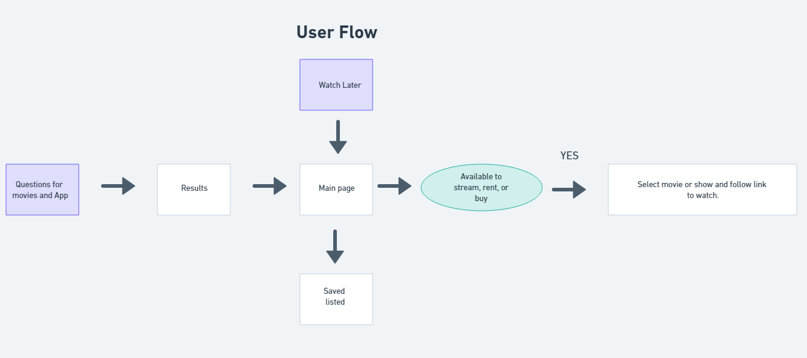

# Project One Stream Machine "Server API" Debug Thugz

## User Story

*   As a movie lover and binge watcher, I want to use an app that recommends new movies to watch based on my preferences.

*   When I open the app, I am prompted to select whether I want to find a movie to watch based on genres I answered 
and where to stream it.

*   I can then tap on a movie/show to view more details, such as were to watch, ratings, genres, languages, and what streaming app I can use.

*  As a user I want to be able to save movies to a watch later list.

## Acceptance Criteria

*   It is done when the app should have a user-friendly interface that allows users to easily navigate and access features.

*   It is done when a user is recommended movies based on genres question.

*   It is done when the recommendations display key data points such as genre, rating and streaming service to help the user make the most informed movie decision.

*   It is done when the app allows users to save movies and shows to a watch later list, which can be easily accessed and updated.

*   It is done when the app provides accurate information about where movies can be streamed, a description of the movie and should update this information in real-time as streaming services add or remove content.

*   It is done when the app works in Chrome.

## Project Requirements

As a group we will use everything we’ve learned over the past six modules to create a real-world front-end application that you’ll be able to showcase to potential employers. The project must fulfil the following requirements:

* Use a CSS framework other than Bootstrap.

* Be deployed to GitHub Pages.

* Be interactive (i.e., accept and respond to user input).

* Use at least two [server-side APIs]

* Does not use alerts, confirms, or prompts (use modals).

* Use client-side storage to store persistent data.

* Be responsive.

* Have a polished UI.

* Have a clean repository that meets quality coding standards (file structure, naming conventions, follows best practices for class/id naming conventions, indentation, quality comments, etc.).

* Have a quality README (with unique name, description, technologies used, screenshot, and link to deployed application).

## Technologies used

*   JavaScript

*   Style Css

*   Google Font (HEADER) Name: Bebas Neue

*   Used The Movie Database API [Click here to go to site](https://developers.themoviedb.org/3/discover/tv-discover)

*   Used Streaming Availability by Movie of the Night from Rapid API [Click here to go to site](https://rapidapi.com/movie-of-the-night-movie-of-the-night-default/api/streaming-availability/)

## Web Developers

*   McKay Memmott -- [Github link](https://github.com/mkidee)

*   Hattie Steed -- [Github link](https://github.com/hattiesteed)

*   Zach Cook -- [Github link](https://github.com/zwcook801)

*   Fabian Barranco -- [Github link](https://github.com/CaptFlopp3y)

## User Flow

## WireFrame

